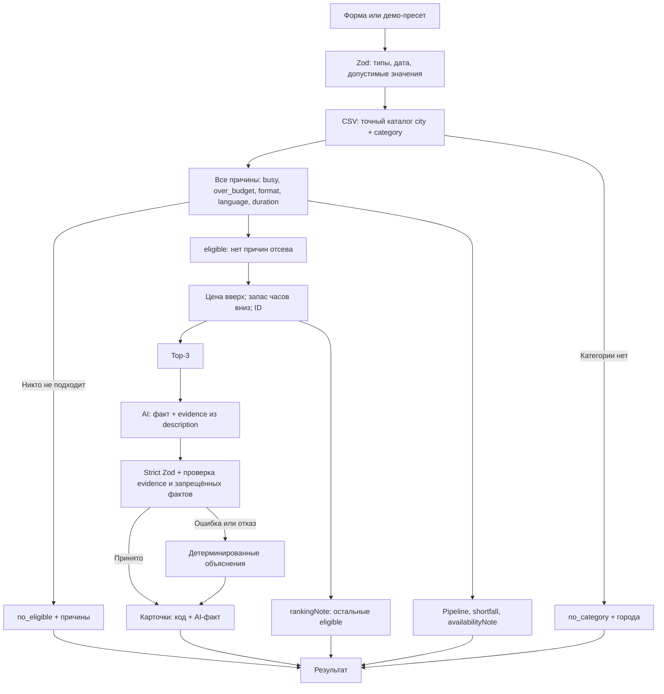

# Qorgan: умный подбор подрядчиков

До трёх доступных event-подрядчиков из каталога города с конкретными объяснениями выбора, занятости и причин отказа.

**Production: https://qorgan-xi.vercel.app**

HackAlem AI 2026, case #79-lite. Заказчику нужно выбрать из готового каталога, а не получить ещё один длинный список. Qorgan проверяет ограничения кодом, показывает альтернативы и добавляет проверяемые факты из описаний через AI.

## Проверка за 2 минуты

Первые шесть строк доступны кнопками над формой: кнопка заполняет поля и отправляет настоящий `POST /api/recommend`. A/A2/B вводятся в обычной форме или через API. Пустые длительность и язык не передаются. Все девять сценариев проверены локальными и публичными production HTTP-запросами на реальном CSV; IDs, статусы и бизнес-поля совпали.

| Сценарий | Параметры: город / дата / формат / категория / бюджет, ₸ | Результат |
| --- | --- | --- |
| Плотная категория (D1) | Алматы / 2026-09-30 / корпоратив / Ведущий / 1 000 000 | `matched`, подходят 6 из 10; `HK-88430 → HK-44923 → HK-35215`. Аня Форджер вошла бы в тройку, но занята; оставшиеся подходящие перечислены в порядке ranking. |
| Та же, другая дата (D2) | Алматы / 2026-10-10 / корпоратив / Ведущий / 1 000 000 | `matched`: `HK-88430 → HK-29829 → HK-27222`. Из тройки из-за занятости исключена Мицури Канроджи; также заняты Кики и Буллма. |
| Редкая категория | Алматы / 2026-09-23 / свадьба / Флорист / 300 000 | `matched`, 2 из 3: `HK-39372 → HK-90001`. Во всём каталоге города только 2 флориста; у первого цена восстановлена, второй синтетический. |
| Не тянет бюджет (C) | Астана / 2026-09-23 / свадьба / Ведущий / 500 000 | `no_eligible`, 5 дороже бюджета, минимальная цена 600 000. Без длительности и языка. |
| Декабрь: все заняты | Алматы / 2026-12-19 / свадьба / Банкетный зал / 3 000 000 | `no_eligible`, все 7 заняты; 3 проходят остальные условия. Залы используют такой же календарь, как люди. |
| Нет категории в городе | Астана / 2026-09-23 / свадьба / Декоратор / 1 000 000 | `no_category`; категория есть в Алматы: 3 профиля. |
| A | Астана / 2026-09-23 / свадьба / Ведущий / 1 000 000; 8 ч, казахский | `matched`, подходят 4 из 5: `HK-26808 → HK-37181 → HK-80581`. |
| A2 | Как A, дата 2026-09-24 | `matched`: `HK-80581`; shortfall и заметка объясняют занятость остальных. |
| B | Астана / 2026-09-23 / корпоратив / Флорист / 500 000; русский | `matched`: `HK-90002`, синтетический профиль, цена 300 000. |

Пример тела API-запроса A:

```json
{"city":"Астана","date":"2026-09-23","eventType":"свадьба","category":"Ведущий","budgetKzt":1000000,"durationHours":8,"language":"казахский"}
```

## Как работает



Обязательный вход: `city`, `date`, `eventType`, `category`, `budgetKzt`. Необязательный: `durationHours`, `language`. Дата должна существовать и лежать в диапазоне **2026-09-23 — 2026-12-31**. Бюджет положительный целый, длительность от 1 до 24 целых часов; город, формат, язык и категория проверяются по допустимым значениям. Неизвестная категория и лишние поля дают HTTP 400, а не `no_category`.

У каждого отклонённого профиля `rejected[]` содержит **все** причины. Pipeline считает последовательное уменьшение каталога: свободны → формат → бюджет → язык → длительность. Сортировка подходящих: цена по возрастанию, затем при заданной длительности запас часов по убыванию, затем стабильный ID. `max_hours: null` не ограничивает длительность. Рейтинг качества не выдумывается.

`availabilityNote` использует только профили с единственной причиной `busy`: общий comparator применяется к eligible вместе с ними, чтобы назвать тех, кто вошёл бы в тройку без занятости. Реальные результаты от этого не меняются. Остальные busy-only также перечисляются. При `eligible > 3` поле `rankingNote` показывает остальных подходящих в том же порядке.

Основные файлы: `lib/catalog.ts` (PapaParse), `lib/search.ts` (Zod), `lib/match.ts` (правила и ranking), `lib/explanations.ts` (проверка фактов и fallback), `lib/openai.ts` (единственный вызов модели), `lib/prompts.ts`, `app/api/recommend/route.ts`, `components/SearchForm.tsx`. Пресеты содержат только параметры в `lib/demo-presets.ts`, не готовые ответы.

## Три исхода

- **matched:** 1–3 карточки с именем, категориями, городом, ценой, языками, часами, badges и 1–2 предложениями объяснения. При неполной тройке shortfall сообщает размер каталога и причины.
- **no_category:** в выбранном городе категории нет; показаны другие города и количество профилей.
- **no_eligible:** каталог есть, но никто не проходит; показаны причины и, если все дороже бюджета, минимальная цена.

В форме есть loading, invalid input и server error. Некорректный JSON/ввод возвращает 400; ошибка каталога возвращает безопасный 500 без stack trace или секретов. Пустой результат не считается ошибкой сервера.

## Роль AI и надёжность

Код фильтрует, ранжирует и считает бюджет; модель объясняет уже зафиксированные top-3. OpenAI Responses API через `responses.parse()` и `zodTextFormat` возвращает строгую схему:

```ts
{ explanations: { id: string; distinctiveFact: string | null; evidence: string | null }[] }
```

Один пакет для всех карточек. AI не может менять IDs, порядок, фильтры, статус, pipeline, shortfall или заметки. Первое предложение всегда детерминированное: цена, бюджет, запас денег и различия внутри выдачи. Второе допускается только после проверки.

Evidence длиной 10–150 символов должно находиться в description после Unicode/регистровой/пробельной нормализации. Zod проверяет схему повторно; неизвестные IDs игнорируются, дубли/пропуски получают fallback. Код отбрасывает многофразовые дополнения, рекламные фразы и личные сведения. Пользовательский текст отделён от инструкций. `explanationSource` равен `ai` только при принятом факте, иначе `fallback`; `explanationEvidence` содержит исходную цитату либо null.

Общий AI deadline **7 секунд** с AbortController; максимум одна повторная попытка при достаточном остатке времени. Missing credentials, timeout, сбой сети, refusal или невалидный ответ не ломают подбор. При пустых исходах AI не вызывается.

In-memory Map хранит до **200** завершённых structured-ответов, вытесняя старейший. Ключ учитывает нормализованный запрос, модель и данные top-3, но не секрет. Evidence проверяется и на cache hit. Ошибки/timeout не кешируются. Повторный текст сохраняется только в том же процессе до вытеснения; перезапуск или другой экземпляр Vercel может дать новый текст. Порядок карточек от кеша не зависит.

Диагностика: `X-AI-Attempts`, `X-AI-Retry`, `X-AI-Verified`, для matched также `X-AI-Cache` и `Server-Timing`. Cache hit означает 0 новых AI-попыток.

## Запуск и проверки

Стек: Next.js 16.3.6 App Router, React 19.3.0, TypeScript strict, Tailwind, Zod, PapaParse, OpenAI SDK. Проверено с **Node.js 24.11.1 и npm 11.6.2**.

macOS/Linux:

```bash
git clone https://github.com/BAITC-Hacks/hack-9ac93bf8-qorgan.git
cd hack-9ac93bf8-qorgan
npm ci
cp .env.example .env.local
npm run dev
```

Windows PowerShell:

```powershell
git clone https://github.com/BAITC-Hacks/hack-9ac93bf8-qorgan.git
cd hack-9ac93bf8-qorgan
npm ci
Copy-Item .env.example .env.local
npm run dev
```

Открыть http://localhost:3000. **Ключ не обязателен:** с пустым ключом либо без env-файла выдача работает с fallback. Для AI заполнить локально `OPENAI_API_KEY`; `OPENAI_MODEL=gpt-5.4-mini` уже указан в примере. Модель читается только из env, OpenAI вызывается только сервером. Реальные env-файлы и `.vercel/` игнорируются Git; `.env.example` не содержит ключа.

```bash
npm run typecheck
npm run lint
npm test
npm run build
npm run start
```

36 offline-тестов проверяют реальные 66 профилей, A/A2/B/C/D1/D2, все пресеты, занятость залов, все причины отсева, детерминизм, optional-поля, CSV с запятыми/кавычками/multiline, безопасные ошибки, evidence и запрещённые факты. Контролируемый SDK-транспорт используется только в тестах для ошибок, настоящего семисекундного timeout и cache hit/eviction; runtime не содержит mocks.

## Данные

`data/contractors.csv` является CSV-версией официального набора **тех же 66 анонимизированных профилей**, включая 13 синтетических. Собственные профили не добавлялись. Списки разделены `|`, `True/False` преобразуются в boolean, пустые часы в null. PapaParse использует `header: true`, сохраняет запятые, кавычки и многострочные описания.

Флаги показаны честно: `synthetic` → «Синтетический профиль», `price_imputed` → «Цена восстановлена в датасете», `city_imputed` → «Город восстановлен в датасете». Восстановленная стартовая цена не является окончательной сметой. Имена вымышленные.

## Деплой

Vercel, проект `maxots-projects/qorgan`; публичный stable alias указан в начале README. Production env для AI: `OPENAI_API_KEY` (Secret), `OPENAI_MODEL=gpt-5.4-mini`. Развёртывание привязанного проекта: `npx vercel --prod`.

Публичные GET страницы и POST API работают без Vercel login. CSV доступен в serverless runtime без дополнительного file tracing. Production smoke 23.09.2026: D1 **3428 мс**, A **2244 мс**, по 3 принятых AI-факта, одна попытка без retry. Повторные D1/A сохранили полные тексты, `X-AI-Cache: hit`, attempts=0, **211/204 мс**. Это одиночные измерения, не гарантия latency или общего кеша между serverless instances.

## Ценность, ограничения и развитие

Заказчик видит не только короткий список, но и почему дешёвый подходящий кандидат исчез при смене даты, кто ещё проходит и почему в редкой категории нет трёх вариантов. Отличие подхода: контрфактическая проверка занятости тем же ranking, прозрачные причины отсева и AI-факт, который код может отклонить без изменения рекомендации.

Проверка evidence подтверждает наличие цитаты, но не доказывает полностью смысловую связь каждого утверждения; deny-list не покрывает все перефразирования. Если структурированные данные не различают профили, fallback честно сообщает об этом. Календарь ограничен официальным окном и не синхронизируется с внешними системами. Визуальный проход UI остаётся ручной проверкой; HTTP API и тесты проверяются автоматически.

Бронирования, БД, auth, embeddings и semantic ranking нет. Возможное развитие, **не реализовано**: свободный текст пожеланий и семантический поиск, синхронизация календарей, пакет «зал + ведущий на одну дату».

## Использованные внешние материалы

- Официальное ТЗ HackAlem AI 2026 case #79-lite и официальный анонимизированный CSV-датасет.
- Runtime npm: `next`, `react`, `react-dom`, `papaparse`, `zod`, `openai`.
- Dev npm: `@tailwindcss/postcss`, `tailwindcss`, `typescript`, `tsx`, `eslint`, `eslint-config-next`, `@types/node`, `@types/react`, `@types/react-dom`, `@types/papaparse`; точные версии в `package-lock.json`.
- OpenAI Responses API и [официальная документация Structured Outputs](https://developers.openai.com/api/docs/guides/structured-outputs).
- AGENTS.md подготовлен заранее как набор правил для AI-агентов.
- AI-инструменты подготовки и разработки: Codex, ChatGPT, Claude.
- Скиллы: docx для чтения официального условия, OpenAI Docs для сверки API, frontend-design для изменений формы без redesign; не runtime-зависимости.
