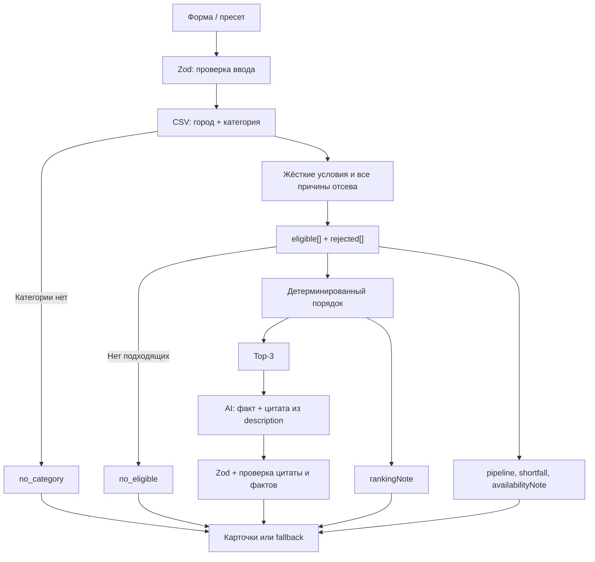

# Qorgan — умный подбор подрядчиков

До трёх доступных подрядчиков под дату и бюджет — с объяснением каждого выбора и причин отказа остальных.

**Production:** https://qorgan-xi.vercel.app

**Case:** HackAlem AI 2026 #79-lite

Пользователь уже имеет каталог подрядчиков своего города. Qorgan помогает выбрать из него, объясняя рекомендации и причины отсева, а не выдаёт новый длинный список.

## Проверка за 2 минуты

Откройте production и нажмите один из шести примеров над формой: каждый отправляет реальный `POST /api/recommend`. В таблице вход дан как город / дата / формат / категория / бюджет в тенге.

| Сценарий | Параметры: город / дата / формат / категория / бюджет, ₸ | Результат |
| --- | --- | --- |
| D1 · плотная категория | Алматы / 2026-09-30 / корпоратив / Ведущий / 1 000 000 | `matched`; 6 из 10 подходят, показаны `HK-88430 → HK-44923 → HK-35215`. Аня Форджер занята и вошла бы в тройку на свободную дату. |
| D2 · другая дата | Алматы / 2026-10-10 / корпоратив / Ведущий / 1 000 000 | `matched`; `HK-88430 → HK-29829 → HK-27222`. Из-за занятости исчезает Мицури Канроджи. |
| Rare · редкая категория | Алматы / 2026-09-23 / свадьба / Флорист / 300 000 | `matched`; только `HK-39372 → HK-90001`. Стартовая цена первого восстановлена, второй профиль синтетический. |
| C · никто не проходит | Астана / 2026-09-23 / свадьба / Ведущий / 500 000 | `no_eligible`; все 5 дороже бюджета, минимальная цена 600 000. Длительность и язык пусты. |
| Нет категории в городе | Астана / 2026-09-23 / свадьба / Декоратор / 1 000 000 | `no_category`; категория есть в Алматы: 3 профиля. |

<details>
<summary>Дополнительные демо</summary>

| Сценарий | Вход | Ожидаемый результат |
| --- | --- | --- |
| Декабрь: все заняты | Алматы / 2026-12-19 / свадьба / Банкетный зал / 3 000 000 | `no_eligible`; все 7 заняты, 3 проходят остальные условия. |
| A | Астана / 2026-09-23 / свадьба / Ведущий / 1 000 000; 8 ч, казахский | `matched`; 4 из 5 подходят, `HK-26808 → HK-37181 → HK-80581`. |
| A2 | Как A, дата 2026-09-24 | `matched`; `HK-80581`, shortfall и объяснение занятости. |
| B | Астана / 2026-09-23 / корпоратив / Флорист / 500 000; русский | `matched`; синтетический `HK-90002`, стартовая цена 300 000. |

Пример тела API-запроса A:

```json
{"city":"Астана","date":"2026-09-23","eventType":"свадьба","category":"Ведущий","budgetKzt":1000000,"durationHours":8,"language":"казахский"}
```

</details>

## Почему это не просто фильтр

Код проверяет все жёсткие ограничения и детерминированно выбирает top-3. AI анализирует только описания уже выбранных профилей: он не меняет допуск, рейтинг или порядок. Неподтверждённый AI-факт отбрасывается, карточка получает объяснение по данным каталога.

## Как работает



**Вход:** обязательны `city`, `date`, `eventType`, `category`, `budgetKzt`; `durationHours` и `language` необязательны. Даты: **2026-09-23 — 2026-12-31**. Бюджет — целое число от 1 до 1 000 000 000 000 ₸, длительность — 1–24 часа. Сервер проверяет типы и допустимые значения. API принимает `Content-Type: application/json`; неверный тип содержимого, неизвестная категория и лишние поля дают HTTP 400.

**Правила:** сначала точное совпадение города и категории, затем дата, формат, бюджет, язык и длительность. `rejected[]` хранит **все** причины для каждого отклонённого профиля; pipeline показывает последовательное уменьшение каталога. `max_hours: null` не отсекает по длительности.

**Ранжирование:** меньшая стартовая цена → при заданной длительности больший запас часов → стабильный ID. Выдуманный quality score не используется: в датасете нет рейтингов, отзывов и истории успешных заказов.

Ключевые файлы: `lib/catalog.ts` (PapaParse), `lib/search.ts` (Zod), `lib/match.ts` (отбор и порядок), `lib/explanations.ts` (проверка фактов и fallback), `lib/openai.ts` (единственный вызов модели), `lib/prompts.ts`, `app/api/recommend/route.ts`, `components/SearchForm.tsx`. `lib/demo-presets.ts` хранит входные параметры, не ответы.

## Три исхода

- **`matched`:** от одной до трёх карточек с ценой, условиями, происхождением данных и объяснением.
- **`no_category`:** в городе категории нет; указаны другие города и число профилей.
- **`no_eligible`:** каталог есть, но никто не проходит; указаны причины и, когда все дороже бюджета, минимальная стартовая цена.

**`shortfall`:** при 1–2 результатах сообщает, сколько найдено и почему нет трёх. **`availabilityNote`:** объясняет влияние занятости; кандидаты с единственной причиной `busy` сравниваются тем же порядком, чтобы утверждение «вошёл бы в тройку» было проверяемым. Остальные busy-only перечисляются отдельно. **`rankingNote`:** при более чем трёх подходящих объясняет показ первых трёх и называет остальных.

Форма различает загрузку, ошибки ввода и сервера. Некорректный запрос получает 400 с понятным сообщением, ошибка каталога — безопасный 500 без секретов.

### Интерфейс живой проверки

Шесть пресетов заполняют форму и отправляют реальный запрос; незаданные optional-поля очищаются. Активный пример выделен. После ответа страница прокручивается к результату; при reduced motion анимации нет.

Четыре баннера различают полную тройку, shortfall и оба пустых исхода. Ниже видны влияние даты, правило порядка, этапы отбора и карточки; остальных подходящих и отклонённых можно увидеть после них.

Карточка показывает позицию, стартовую цену, полное объяснение, флаги происхождения данных, языки, часы и форматы. Форматы берутся серверной страницей из CSV по ID без нового API-запроса. Контекст результата относится к отправленному запросу, даже если форма уже изменена. У AI-дополнения видна проверенная цитата; fallback обозначен как объяснение по данным профиля.

Загрузка блокирует повторную отправку и показывает три скелетона; ошибка предлагает повторить запрос с текущими полями. Ниже 640 px форма одноколоночная. Визуальный проход браузера остаётся ручной проверкой: отсутствие обрезания и горизонтального скролла автоматическими тестами не подтверждено.

## Роль AI и надёжность

OpenAI Responses API вызывается одним запросом для top-3. `responses.parse()` и `zodTextFormat` требуют structured output:

```ts
{ explanations: { id: string; distinctiveFact: string | null; evidence: string | null }[] }
```

Первое предложение объяснения составляет код из цены, бюджета и других проверяемых различий. Второе AI-предложение допускается только после проверки. AI не меняет IDs, порядок, фильтры или счётчики.

Zod повторно валидирует ответ. `evidence` длиной **10–150 символов** ищется в `description` после Unicode, регистровой и пробельной нормализации. Неизвестные/повторные ID, неподтверждённые цитаты, многофразовые, рекламные и личные факты отклоняются. Пользовательский текст отделён от инструкций. `explanationSource` равен `ai` только для принятого факта, иначе `fallback`; `explanationEvidence` содержит цитату или `null`.

Общий deadline — **7 секунд**, допускается одна повторная попытка в оставшееся время. Ошибка модели, отсутствие ключа и невалидный ответ переключают на детерминированный fallback; `no_category` и `no_eligible` не вызывают AI. Если структурированные данные совпали, fallback может указать проверяемое различие календарей, не меняя выдачу.

Кеш в памяти хранит до **200** успешных ответов, учитывая нормализованный запрос, модель и top-3; ошибки не кешируются, цитата перепроверяется при чтении. Между экземплярами Vercel текст AI может отличаться, порядок карточек — нет.

Диагностика: `X-AI-Attempts`, `X-AI-Retry`, `X-AI-Verified`, `X-AI-Cache` и `Server-Timing` для matched. Цитата подтверждает наличие текста в профиле, но **не доказывает полностью смысловую связь** AI-вывода.

## Локальный запуск

Стек: Next.js 16.3.6 App Router, React 19.3.0, TypeScript strict, Tailwind, Zod, PapaParse, OpenAI SDK. Проверено с **Node.js 24.11.1 и npm 11.6.2**.

macOS/Linux:

```bash
git clone https://github.com/BAITC-Hacks/hack-9ac93bf8-qorgan.git
cd hack-9ac93bf8-qorgan
npm ci
cp .env.example .env.local
npm run dev
```

Windows PowerShell:

```powershell
git clone https://github.com/BAITC-Hacks/hack-9ac93bf8-qorgan.git
cd hack-9ac93bf8-qorgan
npm ci
Copy-Item .env.example .env.local
npm run dev
```

Открыть http://localhost:3000. **OpenAI key необязателен:** без ключа детерминированные рекомендации работают с fallback. Для AI заполнить локально `OPENAI_API_KEY`; `OPENAI_MODEL=gpt-5.4-mini` уже указан в `.env.example`. Модель читается только из env, OpenAI вызывается сервером. Реальные env-файлы и `.vercel/` игнорируются Git; `.env.example` не содержит ключа.

## Проверки

```bash
npm run typecheck
npm run lint
npm test
npm run build
```

Последний прогон: **45/45 offline-тестов**, сетка инвариантов по датасету и **43/43 HTTP smoke** локально и на production. Проверяются реальные 66 профилей, все девять демо, граничные условия, CSV, объяснения и отказы AI. `npm run smoke` по умолчанию обращается к `http://localhost:3000`; для production укажите `BASE_URL=https://qorgan-xi.vercel.app`.

<details>
<summary>Подробности тестового покрытия</summary>

`npm test` проверяет **167 400** сгенерированных запросов: 3 города × 17 категорий × 6 форматов × 50 дат (каждая вторая дата окна) × 3 бюджета; для ведущих, фотографов и залов также 4 языка, включая отсутствие, × 4 длительности, включая отсутствие. Эталон независимо читает сырые CSV-поля и не использует функции matcher для фильтров или сортировки. Штатная сетка прошла за **10,4 с**, без коллизий объяснений. Отдельный полный прогон на всех 100 датах проверил **334 800** запросов за **20,4 с**, также без коллизий.

- I1: допустимый status.
- I2: no_category только при пустом каталоге города и категории.
- I3: matched/no_eligible соответствуют числу eligible.
- I4: число карточек равно min(3, eligible).
- I5: каждый результат проходит все жёсткие условия.
- I6: IDs и порядок совпадают с независимым oracle.
- I7: eligible/rejected разделяют каталог; rejected уникальны и сохраняют все причины.
- I8: pipeline не возрастает до eligible; returned отдельно совпадает с числом карточек.
- I9: shortfall есть только при matched с неполной тройкой, found точен.
- I10: reasonCounts совпадают с частотами причин.
- I11: availableElsewhere содержит верные счётчики других городов.
- I12: availabilityNote называет только busy-only; заявление «вошёл бы в тройку» подтверждено контрфактическим ranking, остальные busy-only перечисляются отдельно.
- I13: второй вызов matcher даёт deep-equal результат.
- E1: fallback содержит 1–2 предложения.
- E2: нет запрещённых фактов, source=fallback, evidence=null.
- E3: тексты попарно различны после удаления имён всех карточек.
- E4: запас бюджета точно равен budget − price.
- E5: у единственной карточки нет сравнительных превосходных утверждений.

`tests/boundaries.test.ts` проверяет равенство цены/бюджета и часов, превышение на единицу, null hours, границы даты/бюджета, мультикатегорийные площадки, Зарубежье и занятый декабрь. Для полного прогона: `INVARIANT_DATE_STEP=1 npm test`; PowerShell: `$env:INVARIANT_DATE_STEP='1'; npm test`.

HTTP smoke: `scripts/smoke.mjs`, **43 проверки** с таблицей PASS/FAIL и ненулевым exit code при FAIL. HTTP использует встроенный Node fetch; CSV-parser и deny-list переиспользованы из приложения, новых зависимостей нет. Проверяются GET страницы, 9 демо, 23 неверных ввода, optional-поля, методы API, 10 параллельных запросов и 20 последовательных для p50/p95. Прямые API-запросы с пустой строкой/null в optional-поле получают 400; форма такие поля не отправляет, запрос без них получает 200.

Для локальной проверки сначала `npm run build`, затем в первом терминале запустить сервер без credentials даже при наличии `.env.local`:

```bash
OPENAI_API_KEY=' ' OPENAI_MODEL=' ' npm run start
# Во втором терминале:
EXPECT_FALLBACK=1 npm run smoke
# Production:
BASE_URL=https://qorgan-xi.vercel.app EXPECT_FALLBACK=0 npm run smoke
```

PowerShell:

```powershell
$env:OPENAI_API_KEY=' '; $env:OPENAI_MODEL=' '; npm run start
# Во втором терминале:
$env:EXPECT_FALLBACK='1'; npm run smoke
# Production:
$env:BASE_URL='https://qorgan-xi.vercel.app'; $env:EXPECT_FALLBACK='0'; npm run smoke
```

`BASE_URL` по умолчанию `http://localhost:3000`, можно указать другой порт. `EXPECT_FALLBACK=1` дополнительно требует ноль AI-попыток. На production 10 параллельных запросов и latency-серия используют Demo C без AI, локально concurrency проверяет matched Demo A. Поэтому p50/p95 относятся **к Demo C без AI**; время matched-демо выводится отдельно. Для AI-карточек проверяются предложения, deny-list и цитата в CSV. Suite ограничивает live AI attempts числом 15; при повторном прогоне передайте уже использованное число через `SMOKE_AI_CALLS_USED` из предыдущего отчёта (по умолчанию 0), чтобы сохранить общий лимит.

</details>

## Данные

`data/contractors.csv` — CSV-версия официального набора **66 анонимизированных профилей**, включая **13 синтетических**; собственные профили не добавлены. PapaParse читает CSV с `header: true`, сохраняя кавычки, запятые и многострочные описания. Списки, включая `busy_dates`, разделены `|`; `True/False` становятся boolean, пустой `max_hours` — `null` без ограничения длительности.

Карточки показывают флаги `synthetic`, `city_imputed`, `price_imputed`. `busy_dates` используется как статичный календарь занятости; имена вымышленные.

## Деплой

**Production:** https://qorgan-xi.vercel.app. Vercel-проект `maxots-projects/qorgan`. Production env: `OPENAI_API_KEY` (Secret), `OPENAI_MODEL=gpt-5.4-mini`. Развёртывание привязанного проекта: `npx vercel --prod`.

Публичный GET `/` и POST API работают без авторизации; CSV читается в serverless runtime. Production smoke 23.09.2026 прошёл **43/43**. Примеры отдельных замеров: D1 с AI **2593 мс**, C без AI **226 мс**; это не гарантии задержки. Без credentials работает детерминированный fallback.

## Ограничения и развитие

Проверка evidence подтверждает присутствие цитаты в описании, но **не полностью проверяет смысловую связь** с выводом модели. Список запрещённых фактов не охватывает все перефразирования. Если структурированные данные не различают профили, fallback сообщает об этом. Календарь статичен и ограничен окном датасета; стартовая цена не равна окончательной смете. Визуальный проход UI остаётся ручной проверкой.

**Не реализовано:** бронирование, БД, авторизация, embeddings и семантическое ранжирование. **Возможное развитие, не реализовано:** свободный текст предпочтений и семантический поиск, синхронизация календарей, подбор пакета «зал + ведущий на одну дату».

## Использованные внешние материалы

- Официальное ТЗ HackAlem AI 2026 case #79-lite и официальный анонимизированный CSV-датасет.
- Runtime npm: `next`, `react`, `react-dom`, `papaparse`, `zod`, `openai`.
- Dev npm: `@tailwindcss/postcss`, `tailwindcss`, `typescript`, `tsx`, `eslint`, `eslint-config-next`, `@types/node`, `@types/react`, `@types/react-dom`, `@types/papaparse`; точные версии в `package-lock.json`.
- OpenAI Responses API и [официальная документация Structured Outputs](https://developers.openai.com/api/docs/guides/structured-outputs).
- AGENTS.md подготовлен заранее как набор правил для AI-агентов.
- AI-инструменты подготовки и разработки: Codex, ChatGPT, Claude.
- Скиллы: docx для чтения официального условия, OpenAI Docs для сверки API, frontend-design для изменений формы без redesign; не runtime-зависимости.
